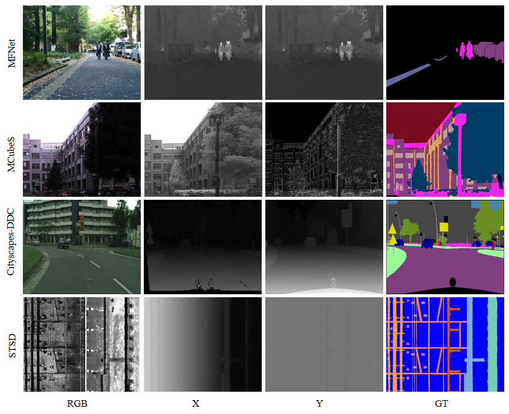
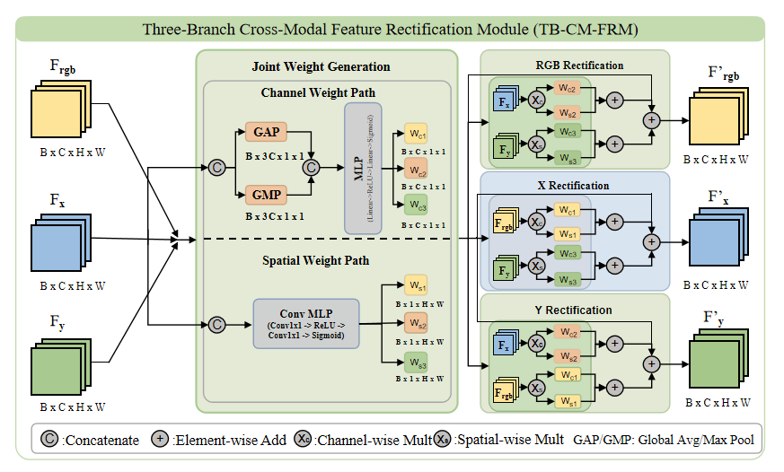
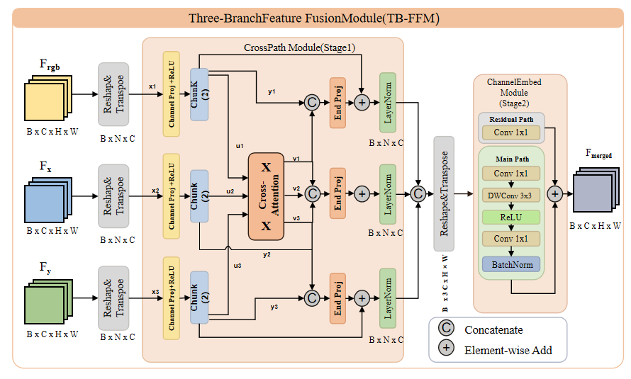

# TRFS
A Tri-Branch Feature Rectification and Fusion Network for RGB-X-Y Multimodal Semantic Segmentation
##  Introduction

Multimodal semantic segmentation plays a crucial role in complex scene understanding, particularly in demanding applications such as infrastructure inspection and subway tunnel disease detection. While traditional dual-branch networks have significantly advanced RGB-X fusion, they frequently struggle with cross-modal spatial misalignment and the inherent noise present in heterogeneous sensor data.

To address these critical challenges, we introduce **TRFS**, a novel **Tri-branch Multimodal Semantic Segmentation Network**. Diverging from conventional dual-stream architectures, TRFS introduces a specialized third branch to explicitly handle modality alignment and suppress noise propagation during the feature fusion process. 

Our framework is highly optimized for the robust fusion of **RGB images and LiDAR point cloud data**, effectively leveraging the rich photometric textures from RGB and the precise geometric structure from LiDAR to produce highly accurate segmentation maps.
## Installation

1. Requirements

* Python 3.8+
* PyTorch 1.7.0 or higher
* CUDA 10.2 or higher

We have tested the following versions of OS and softwares:

* OS: Ubuntu 18.04.6 LTS
* CUDA: 12.1
* PyTorch 2.3.1
* Python 3.8.11

2. Install all dependencies. Install pytorch, cuda and cudnn, then install other dependencies via:

```bash
pip install -r requirements.txt
```
## Datasets

The data folder is structured as:

```text
<DATASET_ROOT>/
├── cityscapes-DDC/
│   ├── RGB/
│   ├── leftImg8bit/
│   ├── gtFine/
│   ├── depth/
│   ├── train.txt
│   └── test.txt
├── STSD/
│   ├── RGB/
│   ├── Channel_H/
│   ├── Channel_Z/
│   ├── labels/
│   ├── train.txt
│   └── test.txt
├── MCubeS/
│   ├── RGB/
│   ├── NIR/
│   ├── DoLP/
│   ├── labels/
│   ├── train.txt
│   └── test.txt
└── MFNet/
    ├── RGB/
    ├── NIR/
    ├── Thermal/
    ├── labels/
    ├── train.txt
    └── test.txt
```


To intuitively illustrate the heterogeneous characteristics and data distributions of the aforementioned multimodal datasets, we provide a visualization of typical samples from each dataset below. The figures showcase the strictly aligned cross-modal results spanning standard RGB images and various heterogeneous sensor modalities—such as Depth/Disparity maps, Channel H/Z, Near-Infrared (NIR), Degree of Linear Polarization (DoLP), and Thermal infrared—alongside their corresponding semantic segmentation ground truths.   
<p align="center">
  
</p>

> **Figure:** *The datasets used are MFNet, MCubeS, Cityscapes-DDC, and STSD. The X-modal input data consists of thermal infrared, near-infrared, binocular stereo matching disparity maps, and local H-axis channel images of point cloud projections, in that order. The Y-modal input data consists of linear polarization, depth maps, and local Z-axis channel images of point cloud projections, in that order.*

## Models

Currently, we provide code of:

<p align="center">
  
  &nbsp; &nbsp; 
  
</p>

> **Figure:** *Detailed architecture of our proposed modules. **Left:** The Tri-Branch Cross-Modal Feature Rectification Module (TB-CMFRM). **Right:** The Tri-Branch Feature Fusion Module (TB-FFM).*
